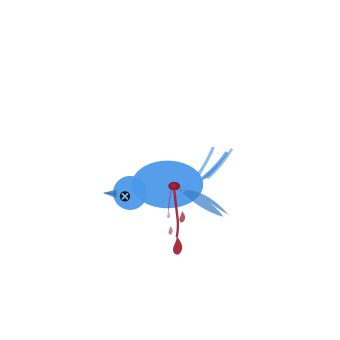

<h1 align="center">Did Twitter Die?</h1>

<p align="center">
  
</p>

> Did Twitter die when it rebranded to X?

A single-page data dashboard comparing the popularity of `twitter.com` vs `x.com` since the July 2023 rebrand - using real data from Tranco, Cloudflare Radar, Cisco Umbrella, Majestic Million, Wikimedia pageviews, and Google Trends.

---

## What it shows

- **Hero snapshot** - latest `twitter.com` vs `x.com` ranks plus Cloudflare Radar DNS buckets
- **Domain popularity over time** - Tranco List rankings aggregated from Cloudflare DNS, Cisco Umbrella, Chrome UX, Majestic, and Farsight
- **Search interest** - Google Trends for `twitter`, `x.com`, and `x`
- **Brand attention on Wikipedia** - Wikimedia pageviews for the relevant Wikipedia titles
- **Direct rank signals** - standalone Cisco Umbrella and Majestic comparisons
- **X / Twitter social rank** - Cloudflare Radar Internet Services rank for the broader service
- **The verdict** - a verdict headline based on Tranco + Cloudflare Radar, with the other sources shown as supporting context

## Pages and routes

- `/` - the dashboard
- `/methodology` - source definitions, attribution, licensing posture, and interpretation notes
- `/privacy` - Cloudflare Web Analytics + Google Trends embed disclosure
- `/api/data` - cached JSON payload used by the frontend

## Data sources

- **Tranco List** - aggregated domain popularity rank
- **Cloudflare Radar Domain Ranking** - DNS popularity buckets for `twitter.com` and `x.com`
- **Cloudflare Radar Internet Services** - service-level social-media rank for `X / Twitter`
- **Cisco Umbrella Top 1M** - direct DNS popularity ranking
- **Majestic Million** - backlink / web-graph popularity ranking
- **Wikimedia Analytics API** - pageview-based attention context
- **Google Trends** - embedded relative search interest

See [ATTRIBUTION.md](ATTRIBUTION.md) for source-specific licensing, trademark notes, and reuse posture.

## Tech stack

- **Frontend**: Vite + React, Tailwind CSS v4, Recharts, Framer Motion
- **Backend**: Cloudflare Pages Functions + Workers KV
- **Scheduled jobs**: standalone Cloudflare Worker for daily refresh + Umbrella backfill
- **Hosting**: Cloudflare Pages

## Data refresh

- `06:00 UTC` - full refresh of the current snapshot data
- `09:00 / 13:00 / 17:00 / 21:00 UTC` - Umbrella backfill, one missing quarter per run
- cached API responses are stored in KV and served from `/api/data`

## Local development

```bash
npm install
npm run dev
```

Useful commands:

- `npm run dev` - start the Vite app
- `npm run build` - production build
- `npm test` - test parser and data-merging behavior
- `npm run lint` - ESLint
- `npx tsc --noEmit` - TypeScript check

For deeper architecture, data flow, and Cloudflare setup, see [DEVELOPMENT.md](DEVELOPMENT.md).

## Deployment

There are two deploy targets:

- **Pages app** - frontend + `functions/`
- **cron worker** - `/cron-worker`

Typical deploy flow:

```bash
npm run build
npm run deploy
```

Then deploy the cron worker separately from `cron-worker/` with Wrangler, including its `REFRESH_SECRET` if needed.

## License & Attribution

- **Project code**: MIT - see [LICENSE](LICENSE)
- **Data attribution and licensing**: see [ATTRIBUTION.md](ATTRIBUTION.md)

## Disclaimer

This project was developed with the assistance of [Claude](https://claude.ai) (Anthropic) and [ChatGPT](https://chatgpt.com) (OpenAI), including code generation, architecture decisions, and logo creation.
